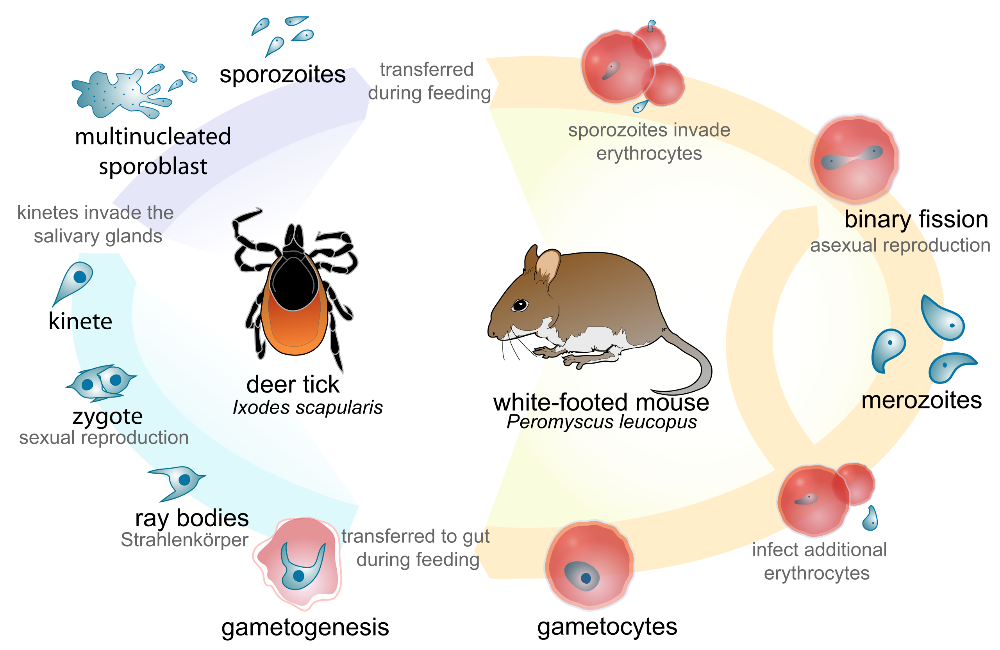
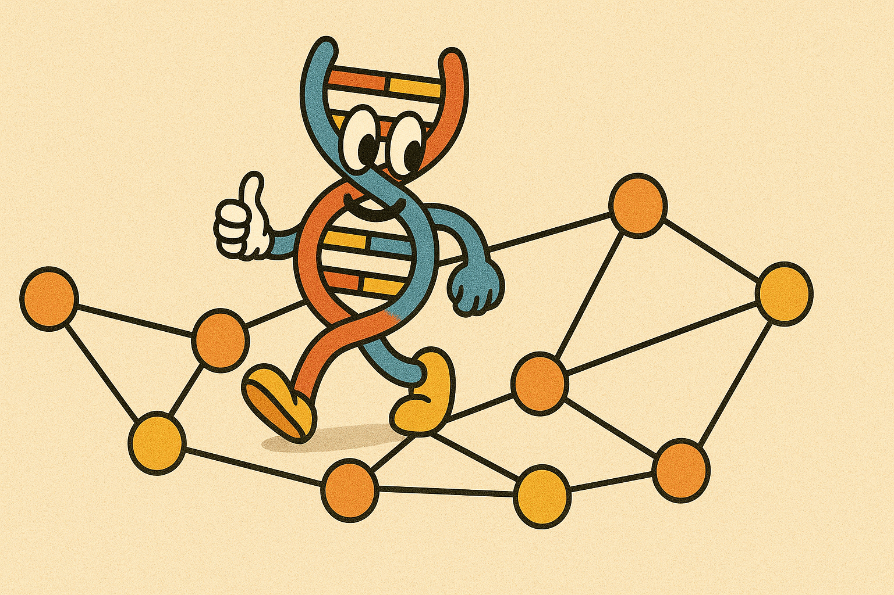
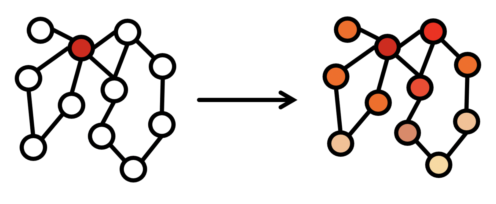
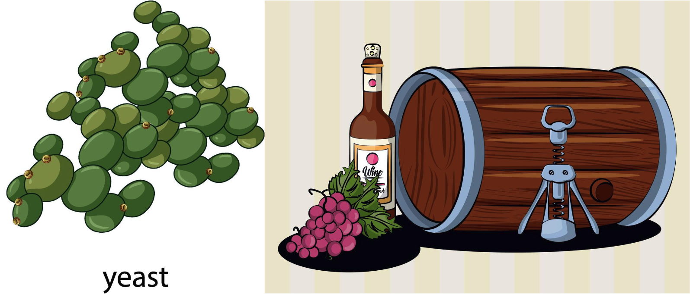

# CSC 448 - Spring 2025


&nbsp;

# Project 4: HMMs, Ticks, and Babesia

In this project you will deploy Markov chains to model the trajectory a Babesia parasite cell undertakes as it goes through different states during the parasite life cycle (in each state different sets of genes are active).



## 1. Biological Background

Babesiosis, a diseases transmitted trough tick bites that manifests with symptoms such as fever, chills, and fatigue, and that may lead to a death, is caused by a parasite called Babesia. The parasite, itself, has a fascinating life cycle characterized by both asexual and sexual reproduction, occurring in two different hosts: a vertebrate and a tick. In the vertebrate host (i.e a mouse), the cells of the parasite are called sporozoites. They get into the vertebrate bloodstream during the blood meal of an infected tick and enter the erythrocytes (red blood cells) where they undergo asexual reproduction, differentiating into gametocytes. When a new tick ingests these gametocytes, they develop into male and female gametes that merge and undergo sexual reproduction, producing new sporozoites that can be transmitted to a new vertebrate host following subsequent bite by the tick, and so on. In fact, scientist have described several more fine-grained stages of the parasite life cycle (trophozoite, merozoite, oocyst) during which the cells change their shape (become round or elongated), change their membrane properties, express different virulent genes to avoid the immune system of the host, silent genes that are not needed, and so on. How is this extremely intricate and complex life-cycle so precisely regulated is not fully understood although researchers have discovered several transcription factors (proteins encoded by genes in the parasite DNA that bind to the parasite DNA and alter its transcription) that orchestrate the switching between sexual and asexual phases.

## 2. The Data

The data comes from a heavily simplified (to make it a feasible project) datasets from the NCBI (National Center of BioInformatics) and CDC (Center for Disease Control). You are given five different cell states, labeled with $S_1,\ S_2, ... S_5$. You will be tracking the cell state trajectory over 10 time points. The following table summarizes the probability of the cell transitioning from one state (row $i$) to another state (column $j$). Note that it is **not** symmetric.


|       | $S_1$ | $S_2$ | $S_3$ | $S_4$ | $S_5$ |
| :-:   |:----: |:----  | :---  | :--   | :--   |
| $S_1$ | 0.86 | 0.09 | 0.01 | 0.03 |  0.01 | 
| $S_2$ | 0.01 | 0.75 | 0.07 | 0.08 | 0.09 | 
| $S_3$ | 0.01 | 0.02 | 0.74 | 0.21 | 0.02 | 
| $S_4$ | 0.21 | 0.24 | 0.22 | 0.21 | 0.12 | 
| $S_5$ | 0.01 | 0.16 | 0.05 | 0.05 | 0.73 | 


Additionally, for part 4, in the data/ folder you will be given two datasets:

1. **actual gene expression across time points.** In order to gauge the actual state the cell is at each time point, measurements of selected marker gene levels are obtained at each time point. These gene activity levels depend on the state the cell is in and, hence, can be used to inform how likely a cell trajectory over the latent states is given the actually observed measurements. You will find the measurements in data/genemarkers_timepoints.tsv. Each row in the file corresponds to a time point and each column to a marker gene expression level.

2. **expected gene expression at a given state.** In data/genemarkers_states.tsv you will find the expected gene expression levels of a typical cell should have in each of the five states. The real measurements will of course vary but you should be able to reason about the state that most likely emitted the actual measurements.


## 3. Basic Markov Chain

First, build a basic Markov model and calculate the probability that the cell ends up in state $S_3$ at the final time point (time point 10) ignoring the measurements in the data/ folder (i.e pretend you don't have any observations yet, so everything is determined by the transitional probabilities from table 1). Note that if done properly you should be able to reuse this code for the next part with a tiny addition.

Assume the cell starts at a special state $S_0$ and there is an equal probability it transitions to any of the other state to kick in the process at time $t=0$. Report the most likely path to $S_3$ in addition to the probability of ending up in state $S_3$. 

## 4. Hidden Markov Model

Now, suppose a researcher provides you the measurements in the data/ folder and asks you to reevaluate your assessment about the probability that the cell ends up in state $S_3$. 

### 4.1 Emit probabilities

Devise an approach that assigns a probability of a particular measurement to have come from a given state, that is calculate a matrix $E$ such that $e_{ij} = Pr(\text{measurement i is emitted from state j}) $. Make sure to discuss in your report why your approach is reasonable.

### 4.2 Viterbi Algorithm

Build upon the basic Markov model from part 3 to create a Hidden Markov Model and implement the Viterbi algorithm. Recalculate the probability that the cell ends up in state $S_3$ at time $t=10$ now that you have gene marker measurements spanning the timeline. Again, make sure to report the most likely path that leads to $S_3$.

## 5. Submit

Turn in the pdf and your code via canvas by the *deadline: June 9th, 11:59pm*.

${\color{red}\large{\text{Note:}}}$ As I need to grade the project and submit final grades for the course to the registrar, the absolute latest you can submit is: ${\color{red}\large{\text{June 11th, 9am.}}}$ 


&nbsp;

&nbsp;


# Project 3: Cancer and Graph Theory



In this project you will combine two seemingly disparate topics- *Cancer Genomics* and *Graph Theory*. Yet, over the past decade, it was graph algorithms that propel our understanding of how supposedly random mutations may lead to cancer. This project is in part inspired by the seminal study published in *Nature Genomics* in 2015 (you can read the paper [here](https://www.nature.com/articles/ng.3168)) in which the authors proposed a graph diffusion algorithm to investigate rare cancer mutations that drive the tumorigenic process. 

Please, start early, this is a long, complex assignment with several layers of abstraction and significant computational runtime. Hence, I inserted several checkpoints to ensure you stay on track. 


## 1. The Data

You are given two datasets:

1. **List of interacting proteins.** A pair of proteins that have been experimentally found to bind to one another or participate jointly in the formation of larger molecular complexes within the cell's cytoplasm are listed in data/interacting\_proteins.txt. For example, a line in the file: ```MAPK3 YWHAB``` means that the mitogen-activated protein kinase 3 (MAPK3) interacts with the Tryptophan 5-Monooxygenase (YWHAB). This dataset comes form the The National Center for Biotechnology Information (NCBI) at Bethesda, MD curated database of human interacting proteins which is the result of decades of laboratory work by numerous scientists.

2. **List of cancer-driving mutated genes**. As part of the landmark [The Cancer Genome Atlas](https://www.cancer.gov/ccg/research/genome-sequencing/tcga) study that span over a decade, 341 patients with kidney cancer (Clear Cell Renal Cell Carcinoma) volunteered to have their tumors being biopsied and studied at the Brigham and Women's Hospital in Boston, Massachusetts and The University of Chicago Medical Center, Illinois. Researchers discovered over 12,000 different mutations occurring in nearly 1,000 different genes revealing an incredibly vast landscape of mostly irrelevant mutations (as to be discussed in class, those are the so-called *passenger* mutations) and only a handful (18 in the published study) of the mutated genes are actual *cancer-driver* genes, i.e the ones that are responsible for the initiation and progression of the cancer. In data/onco\_genes.txt I am providing you with seven of those *cancer-driver* genes. Your job is to computationally discover the rest of the *tumorigenic genes*.

## 2. Biological Intuition

The key biological intuition is that tumor-inducing mutations do not affect all genes but only those genes that encode (synthesize) for proteins involved in critical cell functions such as cell growth, cell division and apoptosis. In class, we will discuss that the hallmarks of tumors are precisely these: uncontrolled cell growth, division, and avoidance of cell death. As we already discovered, proteins carrying a given function work together by binding to each other or forming various, larger molecular complexes to accomplish the task. Hence, proteins involved in the same cellular process (i.e cell growth) will have more connections (edges) in the protein interaction graph and will be closer to one another. That is, the key cancer mutations, when mapped onto the graph nodes would be close to one another within the graph structure. 


## 3. The Graph

Your first job is to model the protein interactions as a graph in which each node corresponds to a protein, an edge between two nodes indicates that the two proteins are interacting with one another, and the weight on the edge reflects the relative strength of their interaction. How you do this, is up to you- you can implement your own data structure or use an existing Python package. I would recommend either using the *NetworkX* Python library or simply storing the graph as a NumPy adjacency matrix (the latter may simplify and speed up significantly your code).


## 3.1 The Shortest Path

Let's start by testing the biological hypothesis that the *tumorigenic genes* are closer to one another in the protein interaction graph using a well-known measure of distance- the shortest path. Calculate the average shortest path between the *tumorigenic genes* and use this single scalar value as a score of network proximity for this set. Next, you would like to evaluate if this score is low, specifically, if it is lower than expected by chance. To do so, compute a background score for sets of *non-tumorigenic genes* (sets of the same size as your original set of *tumorigenic genes*). Calculate the average shortest path between the genes in such sets. Intuitively, it should be much longer than the proteins that are actually involved in the oncogenic process. Build 1000 random sets to establish a background distribution of average shortest paths scores and either confirm or reject the hypothesis that *tumorigenic genes* are closer to one another. Make sure to plot the distribution, calculate a *p-value*, and provide an explanation for the observed result.

**Note**: You can use a Python Scientific Library that implements Dijkstra's algorithm as long as you properly cite it in your report but I will give you extra points if you reuse your own implementation of Dijkstra from CSC 202 and self-cite: *CalPoly CSC 202: own code* :smiley:


## 4. Graph Diffusion and Random Walks

Next, let's consider an advanced algorithm to induce a more network topology aware metric. You can implement either Graph Diffusion or Random Walk with Restarts (RWR) algorithm though I would recommend implementing a simulation of the RWR as it is the easiest to code and debug. 

### 4.1 Toy example

1. To start, consider the toy graph from lecture and calculate the stationary frequencies for all nodes if the walk starts from the node in red at the top:
- use the same weight of 1 on all edges and $\gamma = 0.3$ as fixed restart parameter
- plot the graph, coloring the nodes in the yellow-red scale with the intensity of the red corresponding to magnitude of the stationary frequencies. (here, Cytoscape, a commonly used software tool for visualizing graphs that has tons of features my come in handy, or feel free to explore various Python packages). You should display the stationary frequencies as a label on each node too.
- note that I did the coloring in power point for lecture visualization purposes, your solution will tell us precisely what the colors should be :)



**\*\* Checkpoint 1: turn in your code and first draft of the project report by the deadline: May 18th, 11:59pm**

2. Further test your code to gain intuition on how the algorithm behaves:
- change the weights on some of the edges. Do you observe changes in the stationary frequencies consistent with the direction in which the weighted edges are likely to be sending the walk to. Discuss in your report
- vary the restart parameter and confirm it behaves as expected at the extremes (0 and 1). Make visualization with updated colors. 
- rank the nodes based on their degree, how does this ranking correlate with the stationary distribution ranking of the nodes (especially in the case $\gamma = 1$). Spearman rank correlation test might be helpful here.


### 4.2 Real Data

Once you have your code streamlined and you are confident it works properly, move to the real data.

Use the random walk with restarts (RWR) algorithm (or diffusion if desired) to calculate an average network proximity measure for the set of known *tumorigenic genes*. Specifically, run a RWR starting from one *tumorigenic node* and calculate the stationary frequencies for all other *tumorigenic gens*. Intuitively, if they are close within the network, these frequencies should be high and, more importantly, higher than the stationary frequencies of nodes not related to *oncogenic processes*. Repeat this for every *tumorigenic node* and calculate the average score. As in 3.1, establish a background rate- draw 1000 times random set of proteins and for each set calculate its network proximity score based on RWR. What does the background distribution look like and how extreme is the *oncogenic nodes* score (*p-value*)? Would you accept or reject the hypothesis that they are much closer in the graph according to the new metric?

*Note:* you may need to run your simulation for many more iterations to converge than in the toy example as the graph is much bigger.

**\*\* Checkpoint 2: turn in your code and updated draft of the project report by the deadline: May 22nd, 11:59pm**


### 4.2.3 Predict novel *tumorigenic genes*

Use your proximity scores derived from the RWR to implicate other genes that might be involved in the oncogenic process. Upload your top 30 predicted genes as single gene IDs, each on a new line in file: *FirstName\_LastName\_onco\_predictions.txt*

### 4. Graph Randomization

Finally, to confirm the importance of the graphs structure, randomize the network using the degree preserving edge swapping technique from class. Now that the edges don't represent real interaction between the proteins but link random proteins instead, you shouldn't expect the *tumorigenic nodes* proteins to be in network proximity to one another. Test this intuition. Use the randomized network and repeat the analysis of 4.2. Does the network proximity score for the set of *tumorigenic nodes* differ from that of a random background set?

**\*\* Checkpoint 3: Don't turn anything but aim to be ready with every experiment by May 25th, 11:59pm**

## 5. Submit

Upload your *COMPLETE* (all parts, all experiments, all results) report, the file with your predicted cancer-driving genes and your *COMPLETE* code via canvas by the *FINAL Deadline: May 28th, 11:59pm*.


&nbsp;

&nbsp;


# Project 2. Clustering and Wine Making Yeast


In the second project, you will investigate the biological functions of DNA sequences, that is you will try to figure out what are some of the DNA sequences responsible for. Specifically you will look into protein coding genes and their expression levels in a species of yeast. The goal is to determine which genes are active during the degradation of glucose and ethanol.




## 1. Biological background

Saccharomyces cerevisiae is a species of yeast that brews wine by converting the glucose found in fruit into ethanol.

- If the supply of glucose runs out, *S. cerevisiae* must do something to survive
- It will then invert its metabolism, with the ethanol (alcohol) that it just produced becoming its new food supply
- This metabolic inversion, called the **diauxic shift,** can only occur in the presence of oxygen
- Without oxygen, *S. cerevisiae* hibernates until either glucose or oxygen becomes available


In conclusion, if winemakers don’t seal their barrels, then the yeast in the barrel will metabolize the ethanol that it just produced, ruining the wine.

The diauxic shift is a complex process that affects the expression of many genes.


In 1997, Joseph DeRisi conducted the first massive gene expression experiment by sampling an *S. cerevisiae* culture every two hours for the six hours before and after the diauxic shift. Since there are approximately 6,400 genes in *S. cerevisiae*, and there were seven time points, this experiment resulted in a 6,400 × 7 gene expression matrix.

## 2. The Data

Two files in the github data/ folder:
1. **diauxic\_raw\_ratios.txt** Contains normalized gene expression matrix from the DeRisi's study. Note that it is gene by time point format while in class we mostly discussed gene by cell (sample).
2. **230genes\_log\_expression.txt** List of the 230 most variable genes according to the study. 


## 3. Clustering Analysis 

Perform the following steps to analyze the data and to identify the genes responsible for the diauxic shift.

1. Plot the row data as a heatmap

2. Cluster the genes and plot the clustered matrix
- describe what algorithm you chose, how many clusters you got (big parameter! to pay attention to), calculate the Silhouette score
- discuss whether you can readily identify a group of genes that changes expression patterns together

3. Remove genes not of interest

While you used all 6,400 genes in your initial analysis, typically, genes that have not changed their expression substantially or are known not play a role in the process being investigated are removed to increase the statistical power of the test. That is why most studies actually focus on a subset of *highly variable genes*. 

- devise and implement your own metric for assessing which genes have changed the most (both up and down direction!)
- describe it in your pdf explaining why it is reasonable and what pitfalls it may have
- report the 230 most variable genes according to your metric


4. The authors of the study did their own post-processing of the data and selected a set of 230 most variable genes. 
- Find their set in data/230genes_log_expression.txt
- what is the overlap with your list, i.e how many of the genes are the same, make sure to report together the Jaccard coefficient as well


5. Using the reduced list of 230 genes (derived by the authors) redo your clustering analysis
- are the groups of genes active at different stages identifiable now
 

6. Use the list of genes you identified in the next part:

## 4. Evaluation and Statistical Intuition

Now, you should try to provide further evidence that the genes you identified in part 1 are indeed involved in the diauxic shift of the yeast.

1. Test if your list of genes contains GO terms that are overrepresented using the established GO tool: https://geneontology.org/

- use the second column with gene names (identifiers)
- make sure to select Saccharomyces cerevisiae as species


Let's gain some intuition behind the magic of a *p-value*. For the sake of the exercise suppose that you have a list of 50 items (genes) and 38 of them are colored by (annotated with) *Green*. Of all possible 6000 items, 4260 or 71% are colored with *Green*.

2. Calculate the probability that your list of items (genes) has more *Green* genes than expected by chance

2.1 I'd suggest to run a simulation, where you randomly draw 50 genes out of all 6000 possible genes and count how many *Green* genes you have. Repeat **X** number of times to estimate the probability (write a convincing argument for the value of **X** you chose, see 2.2 below)

2.2 How many simulations (**X**) do you need to run to be certain (define certain) of the probability
- you can try plotting the number trials vs the variance or change of the probability in order to see when it stabilizes

*(Bonus)* Recall the binomial models and derive the mathematical formula for the exact probability (i.e it can be computed analytically). Use it to calculate directly the probability? Does it agree with your simulation?

2.3 Is *Green* appearing more frequently than expected? What if there were 35 or 40 *Green* items in the list rather than 38?

2.4 Find a pair of numbers (n,k) such that if n (number of items in the background) and k (number of items in the research list) are annotated with *Purple*, a student working on this problem will calculate a *p-value* between (0.003 and 0.01) for *Purple*

- you may need to test many pairs and not in uniform ranges to find a suitable pair

2.5 If you test a total of 10 colors, are *Green* and *Purple* significantly overrepresented? 

## 5. Submit

Turn in the pdf (for both parts) and your code via canvas by the *deadline: March 4th, 11:59pm*.


&nbsp;

&nbsp;


# Project 1. Sequences, Bacteria and Evolutionary Trees

In this first project you will combine what you have learned about aligning sequences, working with substitution matrices, using similarity scores and clustering algorithms to ultimately build an evolutionary tree given orthologous proteins sampled from several strains of bacteria.

0. The protein sequences are in the data/ folder of the github. Each sequences begins on a new line with the masked bacteria ID followed by a white tab and then the actual protein sequence.

1. Align two sequences using the Smith–Waterman algorithm:
- you can borrow an implementation from online, however,
- recall that you need to penalize each substitution and you need to use the BLOSUM62 matrix rather than the simple -1 since you are working with protein sequences and not DNA
- BLOSUM62 substitution matrix is available here: https://anaconda.org/bioconda/blosum
- for gap penalty use -12
- note that the Smith–Waterman algorithm score includes all the penalties for mismatches and gaps as well as positive values for correctly matched amino acids, hence, it reflects how well the two sequences align, or in other words, how similar to each other they are

2. Use your implementation of 1 to align every pair of sequences in the file and:
- convert the alignment scores from (1) into a **uniform** similarity measure that can be used to compare all sequences to one another. That is, given the scores you should be able to say, sequence\_i is more similar to sequence\_j than it is to sequence\_k. This may involve some form of normalization of the raw Smith–Waterman scores. Think carefully and explain how you did this in your report
- given your normalized similarity scores for any pair of sequences, construct the similarity matrix (this is the sequence by sequence matrix that is the input to the clustering in step 3)

3. Use a clustering algorithm of your choice to reconstruct the phylogenic tree:
- plot the tree (the *dendrogram* function of matplotlib may come in handy)
- what do you notice about the tree, how would you interpret it
- compare your tree to that of a classmate (discuss your observations in the report)

4. Think about and suggest a way (a metric) to systematically compare the trees reconstructed by the entire class


5. Write a brief pdf project report including:
- plot of the phylogenic tree with your interpretation and discussion
- concise description of your proposed metric to assess similarity between reconstructed trees
- report of the two closets and farthest away proteins (use bacteria id)

6. Turn in the following two files: 
- FirstName_LastName.pdf containing your report
- FirstName_LastName.gz which is a gzipped of all your code

via canvas by the *deadline: Friday 18th, 11:59pm*


# Project 0. Set Up

During the first lab, let's make sure your environment is set up so that you can work without problems on the projects. 


## 1. Anaconda Environment

Anaconda is extremely popular open-source distribution designed for data science, machine learning, bioinformatics and scientific computing, that simplifies package management, environment creation, and deployment, making it easier to install and manage libraries and dependencies for various projects. I strongly recommend installing the full version of Anaconda and using it to encapsulate and manage all of your project dependencies, not just for this class but in general. There is no need to install software or libraries directly on you machine potentially causing conflicts and littering your system. Anaconda takes care of it, creating virtual environments which isolate software and their dependencies from the rest of the software installed on your machine. This means you can have both Python 2.9 and Python 3.7 installed within Anaconda and use both versions without encountering issues while your laptop carries its vanilla factory distribution of Python 3.X. You are not required to install Anaconda, but having it will probably make your life easier.

Visit the official [Anaconda website](https://anaconda.org/).

Explore their [starting tips](https://www.anaconda.com/docs/getting-started/getting-started). I recommend the full version (not the mini conda) and using the terminal/shell (CLI) rather than the GUI.

Here is a useful [cheat_sheet](https://docs.conda.io/projects/conda/en/4.6.0/_downloads/52a95608c49671267e40c689e0bc00ca/conda-cheatsheet.pdf).


### 1.1 Create an environment
Create a *csc448* environment. In general, do not use the *base* environment and don't install packages there. Create a new one.  

### 1.2 Install packages
Within your *csc448* environment, install the *SciPy*, *NumPy*, and *sklearn* libraries. They contain tons of useful functions for scientific computing, data preprocessing and many other utilities.  

### 1.3 Explore
Play on your own to familiarize how Anaconda works.


## 2. Coding

The focus of this class is on the application of computer science algorithms in the domain of molecular biology, understanding their behavior, pitfalls, analyzing their results, designing modifications, etc and not on coding/debugging. Therefore:

- You are encouraged to use all built in scientific computing libraries available through *SciPy* and *NumPy*. In general, you should never (re-)implement classical computer science algorithms (i.e K-means) but rather simply call the appropriate library.

- You are also allowed to use scripts and code from GitHub repositories of other scientists of their published research. You should properly cite the corresponding paper, see Project report for more details.

- You are **not** allowed to use any code from the internet which is not part of a published (in peer reviewed journal) scientific research.

Your code still needs to adhere to the best python coding practices, be extensively commented and properly organized. Points will be deducted if it is not.

## 3. Writing the report

The project report is very important. It should be neatly organized and clearly:

- detail the computational experiments carried with relevant figures
- justify the specific parametric and algorithmic choices made
- describe the biological interpretation of your results

Don't stress out! I realize you may not be very experienced writing one, I will be fairly lenient in the first half as you learn. Here are some tips:

- every figure should have labels on both axis and a color legend
- if you have a parameter (i.e number of clusters), you have to justify how you selected its value. This typically includes testing several different values and selecting the optimal one according to an evaluation metric
- you should always describe what your metric captures and how it behaves
- don't post code or large data within the text. Add a supplementary table file instead

If you use a code from a GitHub of published research, you should include a full reference to the corresponding paper. The GitHub readme page typically contains a citation section that states exactly the name of the paper, the journal, and the year it was published. If you cannot find one then you cannot use it. If in doubt ask me.

## 4. Submitting

For each project, you will upload on canvas two files with the following names: 

- FirstName_LastName.pdf containing your report
- FirstName_LastName.gz which is a gzipped of all your code


## 5. Remember to have fun!


