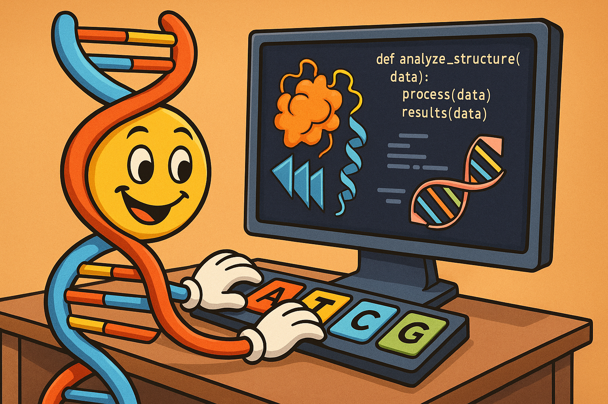

# CSC 448 - Spring 2025

# Project 2. Wine making yeast

In the second project, you will investigate the biological functions of DNA sequences, that is you will try to figure out what are some of the DNA sequences responsible for. Specifically you will look into protein coding genes and their expression levels in a species of yeast. The goal is to determine which genes are active during the degradation of glucose and ethanol.

0. Biological background: 

Saccharomyces cerevisiae is a species of yeast that brews wine by converting the glucose found in fruit into ethanol.

- If the supply of glucose runs out, *S. cerevisiae* must do something to survive
- It will then invert its metabolism, with the ethanol (alcohol) that it just produced becoming its new food supply.
- This metabolic inversion, called the diauxic shift, can only occur in the presence of oxygen.
- Without oxygen, *S. cerevisiae* hibernates until either glucose or oxygen becomes available

In conclusion, if winemakers don’t seal their barrels, then the yeast in the barrel will metabolize the ethanol that it just produced, ruining the wine.

The diauxic shift is a complex process that affects the expression of many genes.

In 1997, Joseph DeRisi conducted the first massive gene expression experiment by sampling an *S. cerevisiae* culture every two hours for the six hours before and after the diauxic shift. Since there are approximately 6,400 genes in *S. cerevisiae*, and there were seven time points, this experiment resulted in a 6,400 × 7 gene expression matrix.

1. Data: in the github data/diauxic\_raw\_ratios.txt

- Note that it is gene by time point format while in class we mostly discussed gene by cell (sample).

2. Plot the row data as a heatmap

3. Cluster the genes and plot the clustered matrix
- describe what algorithm you chose, how many clusters you got (big parameter! to pay attention to), calculate the Silhouette score
- discuss whether you can readily identify a group of genes that changes expression patterns together

4. Remove genes not of interest

While you used all 6,400 genes in your initial analysis, typically, genes that have not changed their expression substantially or are known not play a role in the process being investigated are removed to increase the statistical power of the test. That is why most studies actually focus on a subset of *highly variable genes*. 

- devise and implement your own metric for assessing which genes have changed the most (both up and down direction!)
- describe it in your pdf explaining why it is reasonable and what pitfalls it may have
- report the 230 most variable genes according to your metric

5. The authors of the study did their own post-processing of the data and selected a set of 230 most variable genes. 
- Find their set in data/230genes_log_expression.txt
- what is the overlap with your list, i.e how many of the genes are the same, make sure to report together the Jaccard coefficient as well

6. Using the reduced list of 230 genes (derived by the authors) redo your clustering analysis
- are the groups of genes active at different stages identifiable now
 

7. Use the list of genes you identified in the next part:

## Part 2. Evaluation and statistical intuition

Now, you should try to provide further evidence that the genes you identified in part 1 are indeed involved in the diauxic shift of the yeast.

1. Test if your list of genes contains GO terms that are overrepresented using the established GO tool: https://geneontology.org/

- use the second column with gene names (identifiers)
- make sure to select Saccharomyces cerevisiae as species

Let's gain some intuition behind the magic of a p-value. For the sake of the exercise suppose that you have a list of 50 items (genes) and 38 of them are colored by (annotated with) *Green*. Of all possible 6000 items, 4260 or 71% are colored with *Green*.

2. Calculate the probability that your list of items (genes) has more *Green* genes than expected by chance

2. 1 I'd suggest to run a simulation, where you randomly draw 50 genes out of all 6000 possible genes and count how many *Green* genes you have. Repeat **X** number of times to estimate the probability (write a convincing argument for the value of **X** you chose, see 4.2 below)

2. 2 How many simulations (**X**) do you need to run to be certain (define certain) of the probability
- you can try plotting the number trials vs the variance or change of the probability in order to see when it stabilizes

*(Bonus)* Recall the binomial models and derive the mathematical formula for the exact probability (i.e it can be computed analytically). Use it to calculate directly the probability? Does it agree with your simulation?

2.3 Is *Green* appearing more frequently than expected? What if there were 35 or 40 *Green* items in the list rather than 38?

2.4 Find a pair of numbers (n,k) such that if n (number of items in the background) and k (number of items in the research list) are annotated with *Purple*, a student working on this problem will calculate a p-value between (0.003 and 0.01) for *Purple*

- you may need to test many pairs and not in uniform ranges to find a suitable pair

2.5 If you test a total of 10 colors, are *Green* and *Purple* significantly overrepresented? 

3. Turn in the pdf (for both parts) and your code via canvas by the *deadline: May 1st, 11:59pm*

# Project 1. Sequences and Evolutionary Trees

In this first project you will combine what you have learned about aligning sequences, working with substitution matrices, using similarity scores and clustering algorithms to ultimately build an evolutionary tree given orthologous proteins sampled from several strains of bacteria.

0. The protein sequences are in the data/ folder of the github. Each sequences begins on a new line with the masked bacteria ID followed by a white tab and then the actual protein sequence.

1. Align two sequences using the Smith–Waterman algorithm:
- you can borrow an implementation from online, however,
- recall that you need to penalize each substitution and you need to use the BLOSUM62 matrix rather than the simple -1 since you are working with protein sequences and not DNA
- BLOSUM62 substitution matrix is available here: https://anaconda.org/bioconda/blosum
- for gap penalty use -12
- note that the Smith–Waterman algorithm score includes all the penalties for mismatches and gaps as well as positive values for correctly matched amino acids, hence, it reflects how well the two sequences align, or in other words, how similar to each other they are

2. Use your implementation of 1 to align every pair of sequences in the file and:
- convert the alignment scores from (1) into a **uniform** similarity measure that can be used to compare all sequences to one another. That is, given the scores you should be able to say, sequence\_i is more similar to sequence\_j than it is to sequence\_k. This may involve some form of normalization of the raw Smith–Waterman scores. Think carefully and explain how you did this in your report
- given your normalized similarity scores for any pair of sequences, construct the similarity matrix (this is the sequence by sequence matrix that is the input to the clustering in step 3)

3. Use a clustering algorithm of your choice to reconstruct the phylogenic tree:
- plot the tree (the *dendrogram* function of matplotlib may come in handy)
- what do you notice about the tree, how would you interpret it
- compare your tree to that of a classmate (discuss your observations in the report)

4. Think about and suggest a way (a metric) to systematically compare the trees reconstructed by the entire class

5. Write a brief pdf project report including:
- plot of the phylogenic tree with your interpretation and discussion
- concise description of your proposed metric to assess similarity between reconstructed trees
- report of the two closets and farthest away proteins (use bacteria id)

6. Turn in the following two files: 
- FirstName_LastName.pdf containing your report
- FirstName_LastName.gz which is a gzipped of all your code

via canvas by the *deadline: Friday 18th, 11:59pm*

# Project 0. Set Up

During the first lab, let's make sure your environment is set up so that you can work without problems on the projects. 

## 1. Anaconda

Anaconda is extremely popular open-source distribution designed for data science, machine learning, bioinformatics and scientific computing, that simplifies package management, environment creation, and deployment, making it easier to install and manage libraries and dependencies for various projects. I strongly recommend installing the full version of Anaconda and using it to encapsulate and manage all of your project dependencies, not just for this class but in general. There is no need to install software or libraries directly on you machine potentially causing conflicts and littering your system. Anaconda takes care of it, creating virtual environments which isolate software and their dependencies from the rest of the software installed on your machine. This means you can have both Python 2.9 and Python 3.7 installed within Anaconda and use both versions without encountering issues while your laptop carries its vanilla factory distribution of Python 3.X. You are not required to install Anaconda, but having it will probably make your life easier.

Visit the official [Anaconda website](https://anaconda.org/).

Explore their [starting tips](https://www.anaconda.com/docs/getting-started/getting-started). I recommend the full version (not the mini conda) and using the terminal/shell (CLI) rather than the GUI.

Here is a useful [cheat_sheet](https://docs.conda.io/projects/conda/en/4.6.0/_downloads/52a95608c49671267e40c689e0bc00ca/conda-cheatsheet.pdf).

### 1.1 Create an environment
Create a *csc448* environment. In general, do not use the *base* environment and don't install packages there. Create a new one.  

### 1.2 Install packages
Within your *csc448* environment, install the *SciPy*, *NumPy*, and *sklearn* libraries. They contain tons of useful functions for scientific computing, data preprocessing and many other utilities.  

### 1.3 Explore
Play on your own to familiarize how Anaconda works.

## 2. Coding

The focus of this class is on the application of computer science algorithms in the domain of molecular biology, understanding their behavior, pitfalls, analyzing their results, designing modifications, etc and not on coding/debugging. Therefore:

- You are encouraged to use all built in scientific computing libraries available through *SciPy* and *NumPy*. In general, you should never (re-)implement classical computer science algorithms (i.e K-means) but rather simply call the appropriate library.

- You are also allowed to use scripts and code from GitHub repositories of other scientists of their published research. You should properly cite the corresponding paper, see Project report for more details.

- You are **not** allowed to use any code from the internet which is not part of a published (in peer reviewed journal) scientific research.

Your code still needs to adhere to the best python coding practices, be extensively commented and properly organized. Points will be deducted if it is not.

## 3. Writing the report

The project report is very important. It should be neatly organized and clearly:

- detail the computational experiments carried with relevant figures
- justify the specific parametric and algorithmic choices made
- describe the biological interpretation of your results

Don't stress out! I realize you may not be very experienced writing one, I will be fairly lenient in the first half as you learn. Here are some tips:

- every figure should have labels on both axis and a color legend
- if you have a parameter (i.e number of clusters), you have to justify how you selected its value. This typically includes testing several different values and selecting the optimal one according to an evaluation metric
- you should always describe what your metric captures and how it behaves
- don't post code or large data within the text. Add a supplementary table file instead

If you use a code from a GitHub of published research, you should include a full reference to the corresponding paper. The GitHub readme page typically contains a citation section that states exactly the name of the paper, the journal, and the year it was published. If you cannot find one then you cannot use it. If in doubt ask me.

## 4. Submission

For each project, you will upload on canvas two files with the following names: 

- FirstName_LastName.pdf containing your report
- FirstName_LastName.gz which is a gzipped of all your code

## 5. Remember to have fun

